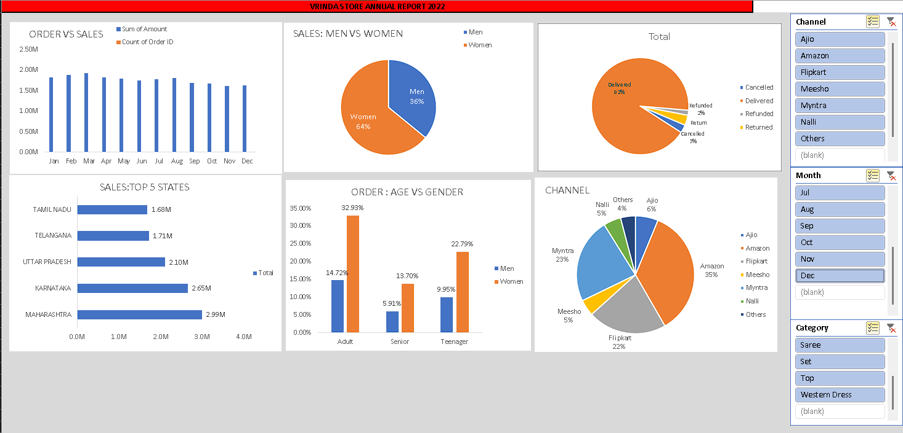

# Vrinda Store Annual Report 2022 📊

This is an Excel-based dashboard built as part of my data analysis learning journey.

## 📁 Project Description
The dashboard shows:
- Order vs Sales trends by month
- Sales by gender and age
- State-wise sales performance
- Order status distribution
- Channel-wise orders

## 🛠 Tools Used
- Microsoft Excel
- Pivot Tables
- Slicers
- Charts (Bar, Pie)

## 📸 Preview

## 📂 Files Included
- `VrindaStore_AnnualReport2022.xlsx`: Main dashboard
- `dashboard_preview.png`: Screenshot of the dashboard

## 📬 Contact
If you have feedback or want to collaborate, feel free to connect!
